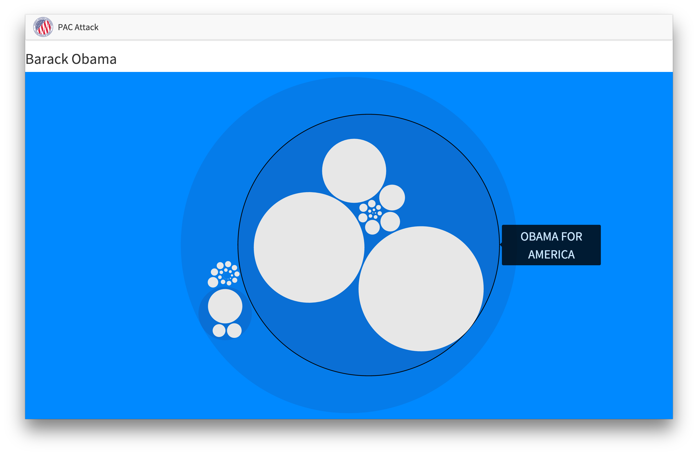
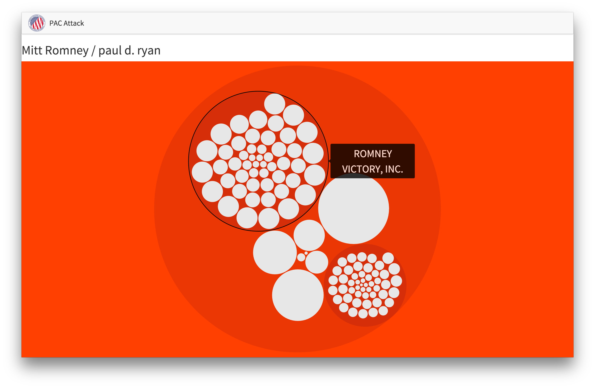

# PAC Attack

## Description

PAC ATTACK allows anybody to "pierce the campaign donation veil" and discover the Political Action Committees that have contributed to a presidential candidates campaign. This Rails application uses the official Federal Election Commission API to access verified campaign disclosures and D3.js for beautiful dynamic visualizations. 

## Screenshots

Home page for PAC ATTACK with a simple search bar for users to search for presidential candidates.

Dynamic visualization for Barack Obama showing the PAC's that donated to his campaign and the nested hierarchy of the committees.

Contrasting visualization for Mitt Romney showing the PAC's that donated to his campaign and the nested hierarchy of the committees.

## Background

Campaign donations allow anybody to buy political influence. While the Federal Election Commission enforces campaign nondisclosures the information is often obscured through overly complicated organizational structures. We developed PAC ATTACK to programmability solve this problem of obfuscation through unnecessary complexity.

## Features

+ Implements the official Federal Election Commission API for verified campaign donation information.
+ Uses D3.js to make beautiful visualizations for each candidate's campaign donation data.
+ Efficiently makes up to 10,000 queries to reveal the obfuscated relationship between donors and Political Action Committees. 

## Development/Contribution

Please feel free to contribute to the project. 

## Authors

Made with &hearts; by // Flatiron School Students:

- [Walter Beller-Morales](https://github.com/walterbm)

- [Travis Emmett](https://github.com/travisje)

## License

PAC ATTACK is MIT Licensed. See LICENSE for details.